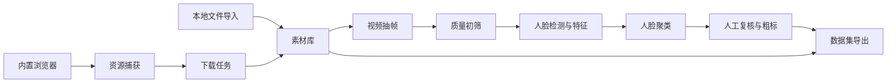

# 视频图片数据集采集与人脸粗标工具设计文档

## 1. 背景与目标

本工具用于从网页、本地视频和图片资源中构建人物图片数据集。目标不是从零实现下载器、标注平台、人脸识别和图像质量算法，而是参考并组合已有 GitHub 开源项目，做一个可在本地 CPU 环境运行的桌面 App。

核心目标：

- 收集网页、本地视频、本地图片等素材资源。
- 从视频中按固定间隔抽帧，例如 1 秒一次。
- 对抽取帧做初筛：模糊、曝光、色彩不足、低信息量、分辨率不足等。
- 当前抽取点不合格时，在下一个抽取点之前向前后搜索可用帧，找不到则跳过。
- 检测图片中的人脸数量。
- 按人脸 embedding 自动分组，并支持人工合并、拆分和改名。
- 粗略标记人物状态，例如正面、侧面、背面、脸部完整程度。
- 基于 metadata 快速筛选和配额组包，例如某个人 30 张正面、20 张侧面、10 张背面。
- 支持本地 CPU 运行，优先保证可部署、可解释、可人工复核。

非目标：

- 不做云端训练平台。
- 不做大规模多人协作标注系统的完整替代品。
- 不绕过平台权限、付费墙、DRM 或版权限制。
- 不把自动识别结果直接视为最终标签，所有关键标签都应支持人工复核。

## 2. 开源项目参考

### 2.1 下载与资源收集

主要参考：

- [weinotes/video-downloader](https://github.com/weinotes/video-downloader)
- [yt-dlp/yt-dlp](https://github.com/yt-dlp/yt-dlp)
- [mikf/gallery-dl](https://github.com/mikf/gallery-dl)

`weinotes/video-downloader` 是最直接的下载模块参考。它提供跨平台 Python 启动脚本、交互菜单、视频/音频/字幕/批量下载、质量选择、浏览器 cookie 提取，以及对 YouTube、B 站等 1000+ 网站的支持。它的底层能力主要来自 `yt-dlp`。

本工具下载模块应采用类似思路：

- 使用 `yt-dlp` 作为视频下载核心，而不是自写各站点解析器。
- 支持 URL 单条下载、URL 列表批量下载、查看视频信息、选择质量。
- 支持从浏览器 cookies 读取登录态，前提是用户已经在本机浏览器合法登录。
- 对图片站、图库、社媒相册优先接入 `gallery-dl`，而不是用临时爬虫。
- 下载器只负责“用户授权资源”的采集，不绕过 DRM、付费限制或网站条款。

内置浏览器参考形态：

- App 内置一个浏览器页面，用户在其中打开目标网页。
- 浏览器负责页面导航、登录、查看资源，不直接破解网页。
- “捕获资源”面板收集页面 URL、媒体链接、图片链接、复制链接。
- 对可由 `yt-dlp` 识别的视频 URL，交给 `yt-dlp` 下载。
- 对可由 `gallery-dl` 识别的图片集合 URL，交给 `gallery-dl` 下载。
- 对普通图片直链，使用 HTTP 下载器保存，并记录来源页面。

### 2.2 数据集浏览与筛选

参考：

- [voxel51/fiftyone](https://github.com/voxel51/fiftyone)
- [cleanlab/cleanvision](https://github.com/cleanlab/cleanvision)

FiftyOne 提供视觉数据集浏览、筛选、标签查看、embedding 可视化和数据质量工作流。本工具不需要完全复刻 FiftyOne，但应参考它的数据集视图和筛选思路。

CleanVision 专注图像数据质量检测，可检测模糊、过暗、过亮、低信息量、灰度图、重复图、异常尺寸等。本工具的自动初筛应优先复用或参考这些检测指标。

### 2.3 视频处理与抽帧

参考：

- [opencv/opencv](https://github.com/opencv/opencv)
- FFmpeg

视频处理不自写解码器。推荐使用：

- FFmpeg/ffprobe：读取视频元数据、稳定抽帧、处理格式兼容。
- OpenCV：快速读取邻近帧、计算模糊度、色彩、曝光等指标。

### 2.4 人脸检测、识别与聚类

参考：

- [deepinsight/insightface](https://github.com/deepinsight/insightface)
- [ageitgey/face_recognition](https://github.com/ageitgey/face_recognition)
- [scikit-learn/scikit-learn](https://github.com/scikit-learn/scikit-learn)

推荐主路线：InsightFace + ONNXRuntime CPU。

原因：

- InsightFace 提供人脸检测、关键点、embedding 能力。
- ONNXRuntime CPU 部署相对稳定。
- embedding 可用于 DBSCAN、HDBSCAN 或层次聚类。

`face_recognition` 可以作为原型参考，但其 Windows 安装和 dlib 依赖较重，不建议作为主线依赖。

### 2.5 标注与导出

参考：

- [cvat-ai/cvat](https://github.com/cvat-ai/cvat)
- [HumanSignal/label-studio](https://github.com/HumanSignal/label-studio)

CVAT 和 Label Studio 都是成熟标注工具。本工具不直接重做完整标注平台，只做面向人物数据集的轻量粗标界面，并兼容常见导出格式。

导出目标：

- JSONL：保留全部内部字段，方便二次处理。
- CSV：方便人工检查。
- COCO：适合目标检测、人脸框数据。
- YOLO：适合检测训练。
- FiftyOne Dataset：方便后续用 FiftyOne 深度浏览和分析。
- CVAT/Label Studio 可导入格式：方便转入成熟标注平台做精标。

## 3. 产品形态

建议做成本地桌面 App。

推荐技术路线：

- UI：Python + PySide6。
- 内置浏览器：QtWebEngine。
- 任务队列：Python multiprocessing / concurrent.futures，后续可换 Celery/RQ。
- 数据库：SQLite。
- 文件存储：本地 dataset 工作区目录。
- 模型推理：ONNXRuntime CPU。
- 视频处理：FFmpeg + OpenCV。
- 下载：yt-dlp + gallery-dl + 普通 HTTP 下载。

选择 Python 桌面路线的原因：

- `weinotes/video-downloader`、yt-dlp、gallery-dl、CleanVision、InsightFace、OpenCV 都能很好接入 Python。
- 本地 CPU 部署简单。
- 快速做出可用工具，不需要一开始维护前后端两套工程。

备选路线：Electron + Python 后端。优点是内置浏览器能力更强，UI 生态更丰富；缺点是打包复杂度和进程通信复杂度更高。MVP 阶段不优先。

## 4. 总体架构



模块职责：

| 模块 | 责任 | 参考项目 |
|---|---|---|
| 内置浏览器 | 打开网页、登录、复制/捕获资源链接 | weinotes/video-downloader 的下载流程 + QtWebEngine |
| 下载器 | URL 下载、批量下载、质量选择、cookie 登录态 | weinotes/video-downloader、yt-dlp、gallery-dl |
| 图片库 | 统一管理图片、图片 metadata、质量和标记状态 | FiftyOne 的 dataset/sample 思路 |
| 导入处理 | 将本地文件、视频、URL 下载结果转换为图片 | weinotes/video-downloader、yt-dlp、gallery-dl |
| 抽帧器 | 按间隔抽帧、邻近帧搜索 | FFmpeg、OpenCV |
| 质量筛选 | 模糊、色彩、曝光、低信息量、重复 | CleanVision、OpenCV |
| 人脸模块 | 人脸框、关键点、embedding、人数统计 | InsightFace |
| 聚类模块 | 按 embedding 分组人物 | scikit-learn |
| 粗标界面 | 正面、侧面、背面、脸部完整度 | CVAT/Label Studio 交互参考 |
| 组包器 | 按人物、朝向、质量、复核状态和目标数量生成子集 | FiftyOne 的筛选思想 + 自定义配额规则 |
| 导出器 | JSONL、CSV、COCO、YOLO、FiftyOne | CVAT、Label Studio、FiftyOne |

## 5. 关键流程设计

### 5.1 导入流程

导入通道：

- 本地视频文件。
- 本地图片目录。
- 单个 URL。
- URL 列表文件。
- 内置浏览器当前页面。

导入通道只负责把外部资源转换成原始素材或 Image。进入 dataset 后，核心对象是图片及其 metadata，而不是资源来源。

内置浏览器页面功能：

- 地址栏、前进、后退、刷新。
- 当前页面加入下载探测。
- 当前选中链接加入下载探测。
- 当前页面图片链接扫描。
- 当前页面媒体链接扫描。
- 下载任务面板显示资源类型、状态、输出路径、错误信息。

下载策略：

- 视频网站 URL：优先调用 `yt-dlp`。
- 图片集合 URL：优先调用 `gallery-dl`。
- 图片直链：普通 HTTP 下载。
- 不识别 URL：保留在导入批次日志中，允许用户手动选择下载器或跳过。

下载元数据只用于任务调试和重复处理，不默认进入最终 dataset 导出：

- 原始 URL。
- 页面 URL。
- 下载器类型：`yt-dlp` / `gallery-dl` / `http` / `local`。
- 标题、作者、发布时间、站点名、视频时长、格式、分辨率。
- cookies 来源浏览器，仅记录浏览器类型，不保存敏感 cookie 内容到数据库。

### 5.2 视频抽帧流程

配置项：

- 抽帧间隔：默认 1 秒。
- 搜索步长：默认 0.2 秒。
- 搜索窗口：从当前抽取点到下一个抽取点之前。
- 最大候选数：默认 5 到 9 个。
- 最小分辨率：例如短边不小于 512。

抽帧算法：

1. 获取视频时长 `duration`。
2. 生成抽取点：`0, interval, 2 * interval, ...`。
3. 对每个抽取点 `t` 先抽当前帧。
4. 计算质量分。
5. 如果合格，保存。
6. 如果不合格，在 `[t, min(t + interval, duration))` 内按 `t, t + step, t - step, t + 2 * step, ...` 搜索。
7. 找到第一张合格帧则保存，并记录实际时间戳。
8. 如果没有合格帧，则记录 skipped。

注意：第一版可以只向后搜索，降低实现复杂度；第二版再做前后交错搜索。

### 5.3 质量初筛

质量指标：

| 指标 | 计算方式 | 用途 |
|---|---|---|
| 模糊度 | Laplacian variance | 剔除失焦、运动模糊帧 |
| 亮度 | HSV/V 通道均值和极端比例 | 剔除过暗、过曝 |
| 色彩 | HSV/S 通道均值 | 剔除色彩不足、近灰度图 |
| 信息量 | 灰度熵 | 剔除纯色、低纹理图 |
| 分辨率 | 宽高、短边 | 剔除过小图片 |
| 重复度 | pHash / embedding 距离 | 剔除近重复帧 |

质量输出：

- `quality_score`：综合分。
- `quality_flags`：例如 `blurry`、`dark`、`low_color`、`low_information`。
- `decision`：`accepted` / `rejected` / `needs_review`。

阈值不应写死。MVP 提供默认阈值，并允许用户在 dataset 配置中调整。

### 5.4 人脸检测与人数统计

对每张 accepted 或 needs_review 图片执行：

- 检测人脸框。
- 检测关键点。
- 提取 embedding。
- 统计人脸数量。
- 估计最大人脸占比，用于筛选主角图。

输出字段：

- `face_count`。
- `bbox`。
- `landmarks`。
- `confidence`。
- `embedding_path` 或数据库向量字段。
- `face_quality`，例如过小、遮挡、贴边、低清晰度。

### 5.5 人脸分组

聚类流程：

1. 收集所有有效人脸 embedding。
2. 过滤低质量、小尺寸、侧脸过强的人脸，避免污染聚类。
3. 使用 DBSCAN/HDBSCAN 做无监督聚类。
4. 为每组生成代表脸。
5. 人工复核：合并、拆分、重命名、标记误检。

默认建议：

- MVP 使用 DBSCAN，因为 scikit-learn 直接提供，依赖简单。
- 后续加入 HDBSCAN，提高不同密度人物集合的聚类质量。

### 5.6 人物粗标

标签维度：

| 字段 | 取值 |
|---|---|
| 朝向 | `front` / `side` / `back` / `unknown` |
| 脸部完整度 | `full` / `partial` / `none` / `unknown` |
| 人物数量 | 自动统计 + 人工修正 |
| 主体状态 | `single_person` / `multi_person` / `no_person` |
| 可用性 | `trainable` / `reject` / `needs_review` |

自动预标规则：

- 正面：双眼、鼻、嘴关键点稳定，左右脸区域较平衡。
- 侧面：关键点明显偏向一侧，脸框宽高比和关键点分布异常。
- 背面：无脸但可选接入人体检测后判断；MVP 主要由人工标记。
- 脸部不完整：人脸框贴边、关键点缺失、人脸面积过小、清晰度过低。

所有自动标签都标记为 `auto`，人工确认后改为 `reviewed`。

### 5.7 Label 与 Caption 分层

图片 metadata 分为 Label 和 Caption 两类：

- Label：结构化标签，用于快速筛选、统计、配额组包和导出范围控制，例如人物、朝向、质量、完整度、可用性、复核状态。
- Caption：训练文本，用于 image LoRA dataset，例如 caption、positive prompt、negative prompt、模板展开结果。

设计约束：

- Label 应尽量枚举化、可过滤、可统计。
- Caption 可以是自然语言或模板文本，但必须记录来源：自动生成、人工编辑或模板生成。
- 选图时主要使用 Label；训练时主要使用 Caption。
- 导出时 Label 决定“哪些图片进入 dataset”，Caption 决定“这些图片对应的训练文本”。

### 5.8 Metadata 筛选与配额组包

人脸、人物朝向、脸部完整度和质量指标的主要用途是快速筛选和构建满足数量要求的数据集子集，而不仅是展示信息。

典型需求：

- 某个人：30 张正面、20 张侧面、10 张背面。
- 某个人：只要质量合格、已人工确认、非重复的正面图。
- 某个人：排除多人同框或脸部不完整的图片。
- 未来某个物品：正视图、侧视图、背视图、细节图各固定数量。

组包流程：

1. 用户选择主体类型。MVP 固定为 `person`，未来可扩展 `object`。
2. 用户选择主体，例如 PersonCluster。
3. 用户设置配额规则，例如 `front=30`、`side=20`、`back=10`。
4. 系统按质量分、复核状态、重复度、主体完整度排序候选图片。
5. 自动生成 Selection，并提示缺口。
6. 用户可手动替换图片，然后锁定 Selection。
7. 导出时可以导出整个 dataset，也可以只导出某个锁定 Selection。

## 6. 数据模型

### 6.1 ImportBatch

```text
id
type: local_images | local_video | local_directory | url | url_list | browser_capture
created_at
status
input_count
asset_count
image_count
error_count
log_json
```

### 6.2 Asset

```text
id
import_batch_id
type: video | image
path
sha256
width
height
duration
fps
download_tool: yt_dlp | gallery_dl | http | local
metadata_json
```

### 6.3 Image

```text
id
asset_id
image_path
sha256
width
height
frame_target_timestamp
frame_actual_timestamp
quality_score
quality_flags_json
orientation: front | side | back | unknown
face_completeness: full | partial | none | unknown
subject_type: person | object
primary_subject_id
person_count
usability: trainable | reject | needs_review
review_status: auto | reviewed | needs_second_review
status: new | quality_checked | face_processed | clustered | reviewed_trainable | reviewed_rejected | exported
```

### 6.4 Face

```text
id
image_id
bbox_json
landmarks_json
confidence
embedding_path
face_quality_json
cluster_id
is_false_positive
```

### 6.5 PersonCluster

```text
id
entity_type: person
display_name
representative_face_id
status: auto | confirmed | needs_merge_review | ignored
merge_target_id
```

### 6.6 Annotation

```text
id
image_id
person_cluster_id
orientation: front | side | back | unknown
face_completeness: full | partial | none | unknown
person_count
usability: trainable | reject | needs_review
label_origin: auto | user
updated_at
```

### 6.7 Caption

```text
id
image_id
caption
positive_prompt
negative_prompt
template_id
caption_origin: auto | user | template
updated_at
```

### 6.8 Selection

```text
id
name
status: draft | locked | exported
rules_json
summary_json
created_at
updated_at
```

### 6.9 SelectionItem

```text
id
selection_id
image_id
rule_key
rank_score
locked: true | false
```

Selection 不是新的数据标注维度，而是基于 Image metadata 生成的可复现子集。它用于回答“我需要某个人多少张正面、多少张侧面、多少张背面”这类配额筛选问题。

## 7. 界面设计

### 7.1 主导航

- 导入 Inbox。
- 下载任务。
- 图片库。
- 视频抽帧。
- 自动筛选。
- 人脸分组。
- 人工复核。
- 配额组包。
- 导出。

### 7.2 导入页

参考 `weinotes/video-downloader` 的菜单能力，但做成图形界面：

- URL 输入框。
- URL 列表导入。
- 本地图片导入。
- 本地视频导入。
- 内置浏览器。
- 下载质量选择。
- cookie 来源选择：Chrome / Firefox / Edge。
- 下载模式：视频、音频、字幕、图片集合。
- 任务队列和日志。

导入页不承担 dataset 筛选职责；导入完成后，图片进入图片库，由人物、朝向、完整度、质量和可用性等 metadata 管理。

### 7.3 图片库页

- 左侧/顶部：人物、朝向、完整度、人数、质量、复核状态筛选。
- 中间：图片网格，直接显示人物、正面/侧面/背面、质量 flags。
- 右侧：图片 metadata、人脸框、质量指标、标记状态。

### 7.4 抽帧与筛选页

- 左侧：视频列表。
- 中间：帧网格。
- 右侧：质量指标和筛选规则。
- 顶部：抽帧间隔、搜索步长、阈值配置。
- 支持查看“目标时间戳”和“实际保存时间戳”。

### 7.5 人脸分组页

- 左侧：人物分组列表。
- 中间：该人物的 face crop 网格。
- 右侧：候选合并组、聚类参数、代表脸。
- 操作：合并、拆分、标记误检、设置人物名。

### 7.6 人工复核页

- 大图预览。
- 人脸框覆盖层。
- 邻近帧时间轴。
- Metadata 面板：人物、正面/侧面/背面、脸部完整度、人数、质量、可用性。
- 快捷键：通过、跳过、上一个、下一个、切换标签。

### 7.7 组包页

- 左侧：Selection 列表。
- 中间：配额规则，例如某人正面 30、侧面 20、背面 10。
- 右侧：候选图片、已选图片、缺口提示和可替换图片。
- 操作：自动补齐、手动替换、锁定 Selection、导出 Selection。

当前版本主体类型固定为人物；未来扩展物品时，组包页复用同一套主体、视角、质量、复核状态和数量规则。

## 8. 本地 CPU 运行策略

必须支持：

- Windows 本地运行。
- 无 GPU 时可完整执行。
- 模型可下载到本地缓存。
- 任务可暂停、恢复、失败重试。

性能策略：

- 下载、抽帧、质量检测、人脸检测分队列执行。
- 大图只保存一份，缩略图单独缓存。
- embedding 存为 float32 二进制或 numpy 文件，避免 SQLite 膨胀。
- 人脸检测批处理，但 CPU 下默认小批量，避免内存峰值过高。
- 对同一文件使用 sha256 去重。

## 9. MVP 范围

第一阶段只做最小可用闭环：

1. 本地视频/图片导入。
2. URL 单条下载和 URL 列表批量下载，参考 `weinotes/video-downloader` 调用 `yt-dlp`。
3. 1 秒抽帧。
4. 模糊、亮度、色彩、分辨率初筛。
5. 当前帧不合格时，在当前秒内向后搜索可用帧。
6. InsightFace CPU 人脸检测和 embedding。
7. DBSCAN 人脸分组。
8. 人工标记正面/侧面/背面/完整度/可用性。
10. 按人物和朝向做配额组包。
11. JSONL 和 CSV 导出。

第二阶段：

- 内置浏览器完整化。
- 页面图片扫描和 `gallery-dl` 接入。
- COCO、YOLO、FiftyOne、CVAT、Label Studio 导出。
- 近重复检测。
- 聚类合并/拆分体验优化。
- 自动朝向估计优化。
- 物品主体类型和通用视角标签扩展。

第三阶段：

- 插件化下载器。
- 更多模型后端。
- 多 dataset 工作区管理。
- 更强的数据集统计和可视化。

## 10. 风险与约束

### 10.1 下载合规风险

下载功能必须提示用户遵守平台条款和版权法律。工具不应提供绕过 DRM、破解付费内容、规避访问控制的功能。

### 10.2 人脸识别隐私风险

人脸识别和分组涉及敏感生物特征。默认只做本地处理，不上传数据。导出前应提示用户确认数据用途、隐私约束和是否包含人脸 embedding 等敏感 metadata。

### 10.3 CPU 性能风险

CPU 人脸检测和 embedding 会慢。MVP 应提供：

- 只处理 accepted 帧。
- 限制最大图片边长。
- 支持暂停和恢复。
- 支持夜间批处理。

### 10.4 自动标签准确性风险

正面、侧面、完整度自动判断可能误判。设计上必须区分 `auto` 和 `reviewed`，训练导出默认只导出 reviewed 或用户确认的 trainable 数据。

## 11. 推荐依赖清单

| 能力 | 推荐依赖 |
|---|---|
| 桌面 UI | PySide6 |
| 内置浏览器 | PySide6 QtWebEngine |
| 视频下载 | yt-dlp，参考 weinotes/video-downloader 的封装方式 |
| 图片集合下载 | gallery-dl |
| 视频抽帧 | FFmpeg、OpenCV |
| 图像质量 | OpenCV、CleanVision 思路或 CleanVision 依赖 |
| 人脸检测/识别 | InsightFace、ONNXRuntime CPU |
| 聚类 | scikit-learn |
| 数据库 | SQLite |
| 导出 | Python 标准库 json/csv，后续加 pycocotools |

## 12. 结论

没有必要从头实现完整系统。推荐方案是以本地桌面 App 为壳，下载模块重点参考 `weinotes/video-downloader` 并复用 `yt-dlp`，图片集合下载复用 `gallery-dl`，数据集浏览参考 FiftyOne，质量检测参考 CleanVision，视频处理使用 FFmpeg/OpenCV，人脸识别使用 InsightFace，聚类使用 scikit-learn，标注导出兼容 CVAT、Label Studio 和 FiftyOne。

MVP 应先完成“导入/下载 -> 抽帧 -> 初筛 -> 人脸分组 -> 粗标 -> 导出”的闭环，再扩展内置浏览器和高级导出能力。