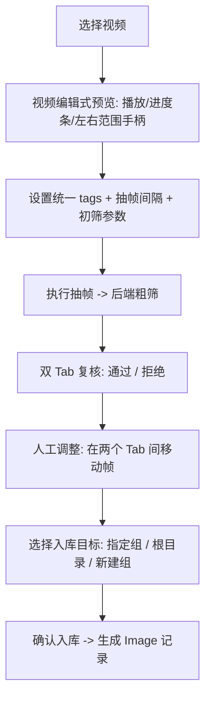

# 视频抽帧工具设计文档（Frame Extraction Plugin）

> 状态：草案，待 review。
> 定位：本工具是一个**独立插件**（drop-in plugin），不内置进主程序；打包后放入
> `app/plugins/video.frame-extraction/` 即自动注册。本文件是该工具的**单点设计文档**，
> 与 `DESIGN.md`（总设计）、`UI_DESIGN.md`（总 UI）保持一致，不引入超出抽帧职责的能力。

---

## 1. 目标与定位

把一段视频转换成一批候选图片（Image），并在**入库前**由用户完成粗筛复核。

- 形态：插件、整页（`ui: "page"`），路由 `/tools/video.frame-extraction`。
- 作用域：`scopes: ["video"]`，从视频库「工具集合」进入，宿主注入当前视频列表。
- 调用约定：前端统一通过 `POST /api/tools/{id}/invoke`（宿主 `invokeTool`）调用后端 `handler.py`。
- 边界：只负责「选视频 → 选范围/参数 → 抽帧 → 粗筛复核 → 入库到组」。
  不做人脸检测、聚类、质量阈值调参页、导出（这些是总设计中的其它独立模块）。

### 与总设计的对齐点（避免跑偏）

| 总设计条目 | 本工具遵循方式 |
|---|---|
| DESIGN 5.2 抽帧流程 | 采样点 = `start, start+interval, ...`；不合格时窗口内邻近帧择优；无合格帧记 skipped |
| DESIGN 5.3 质量初筛 | 复用模糊/亮度/色彩/信息量指标，产出 `quality_score` + `quality_flags` + `decision`（分辨率对同一视频恒定，不作逐帧项，见 §5.3） |
| DESIGN 6.3 Image 模型 | 入库产出的图片带 `frame_target_timestamp` / `frame_actual_timestamp` / 质量字段 |
| enums.FrameStatus | 复用 `extracted` / `replaced_by_neighbor` / `skipped_no_good_frame` / `failed` |
| UI_DESIGN 4.6 抽帧页 | 沿用「配置 + 时间轴 + 帧网格 + 日志」的信息结构，升级为视频编辑式交互 |
| 插件架构 | index.js 自注册 + handler.py `invoke(action,payload,service)` 统一入口 |

**明确非目标**：不在本工具内做人脸检测、聚类、caption、配额组包、格式导出。

---

## 2. 用户流程（对应需求 1–6）



1. **选择视频**：进入工具后先选视频（下拉/列表，来源 `context.videos`）。
2. **视频编辑式取景**：选定后出现类似视频剪辑软件的取景区——上方是可播放的画面，
   下方是可拖动的进度条，进度条**左右两个手柄**用于圈定抽帧范围 `[start, end]`。
3. **统一 tags + 间隔**：范围下方设置 tags（统一打入本次所有产出图片）与抽帧间隔（秒）。
4. **执行抽帧**：调用后端在 `[start, end]` 内按间隔抽帧并做邻近帧择优 + 质量初筛。
5. **双 Tab 复核**：抽帧后**不直接进图片库**，而是展示两个 Tab——
   「粗筛通过」与「初筛拒绝」，每帧显示缩略图、时间戳、质量分与被拒原因。
6. **人工调整 + 入库**：用户可把帧在两个 Tab 间来回移动；最终确认后，选择入库到
   **指定组**、**根目录（无组）**或**新建组后加入**，才真正生成 Image 记录。

---

## 3. 界面设计

整页分三个阶段（单页内切换，非多路由），保留一个顶部步骤指示（取景 → 复核 → 入库）。

### 3.1 阶段一 · 取景与参数

```text
┌──────────────────────────────────────────────────────────────┐
│ [← 返回]  视频抽帧             选择视频: [▼ 哆酱-001.mp4     ] │
├──────────────────────────────────────────────────────────────┤
│                                                                │
│                 ┌────────────────────────────┐                 │
│                 │      画面预览 (当前帧)       │                 │
│                 │   ▶/⏸  00:12.4 / 01:03.0    │                 │
│                 └────────────────────────────┘                 │
│                                                                │
│  胶片缩略条 ▮▮▮▮▮▮▮▮▮▮▮▮▮▮▮▮▮▮▮▮▮▮▮▮▮▮▮▮▮▮▮▮▮▮▮▮▮▮            │
│  进度条    ├───[◧====选定范围====◨]───────────────────┤        │
│           start 00:08.0            end 00:41.0                  │
├──────────────────────────────────────────────────────────────┤
│ Tags(统一打入): [ 哆酱 ] [ 正面 ] [+ 添加]                     │
│ 抽帧间隔: [ 1.0 ] 秒                                            │
│                                        [ 开始抽帧 ]            │
└──────────────────────────────────────────────────────────────┘
```

- **画面预览**：显示 `currentTime` 对应帧。播放/暂停、快退/快进、时间码。
- **进度条 + 双手柄**：单一滑轨，`playhead`（播放头）+ 左右 `start/end` 两个 range 手柄；
  拖动手柄即调整抽帧范围；范围外区域灰显。
- **胶片缩略条（filmstrip）**：范围选择更直观，等距缩略图；点击可跳转 playhead。
- **Tags**：Ant Design tags 输入，本次所有产出图片统一携带。
- **参数**：抽帧间隔（默认 1.0s）。
  不合格时的邻近帧搜索恒为逐帧（步长=1 帧），无需秒级搜索步长参数。
  参数默认值来自总设计 5.2/5.3，可调不写死。

预览取帧策略（见 §5.2 / §5.5）：画面预览优先用**原生 `<video>` 流播放**（宿主
`GET /api/videos/{id}/stream`），支持播放/暂停/拖动；拖动 playhead 时辅以后端
`preview_frame` 防抖取单帧作精确定位。

### 3.2 阶段二 · 双 Tab 粗筛复核（需求 5、6）

```text
┌──────────────────────────────────────────────────────────────┐
│ 抽帧结果   采样点 33 · 通过 27 · 拒绝 6            [重新抽帧]  │
├──────────────────────────────────────────────────────────────┤
│ [ 粗筛通过 (27) ] [ 初筛拒绝 (6) ]                             │
├──────────────────────────────────────────────────────────────┤
│  □缩略图     □缩略图     □缩略图     □缩略图                    │
│  00:08.0     00:09.0     00:10.2*    00:11.0                   │
│  score .82   score .77   替换邻近    score .69                 │
│  [→拒绝]     [→拒绝]     [→拒绝]     [→拒绝]                    │
│  ...                                                            │
├──────────────────────────────────────────────────────────────┤
│                              [ 下一步：入库 ]                  │
└──────────────────────────────────────────────────────────────┘
```

- 两个 Tab：**粗筛通过**（`extracted` / `replaced_by_neighbor`）与
  **初筛拒绝**（`skipped_no_good_frame` / 低分被拒）。
- 每帧卡片：缩略图、目标/实际时间戳、`quality_score`、`quality_flags`（模糊/暗/低色彩…）、
  是否为邻近帧替换。
- **调整**：卡片上「→拒绝 / →通过」把帧在两个 Tab 间移动；支持多选批量移动。
- 复核在**前端本地状态**中进行，此时尚未写入图片库。

### 3.3 阶段三 · 入库目标（需求 6）

```text
┌──────────────────────────────────────────────────────────────┐
│ 确认入库 · 将 27 张「通过」帧加入图片库                        │
├──────────────────────────────────────────────────────────────┤
│ 入库目标:  ( ) 根目录（不分组）                                │
│            (•) 指定已有分组   [▼ 选择图片分组        ]         │
│            ( ) 新建分组       [ 输入分组名称         ]         │
│                                                                │
│ 统一 Tags: 哆酱, 正面                （沿用阶段一，可再编辑）   │
├──────────────────────────────────────────────────────────────┤
│                       [ 取消 ]   [ 确认入库 ]                  │
└──────────────────────────────────────────────────────────────┘
```

- 三选一目标：根目录（`group_id=null`）、指定已有图片分组、新建分组（幂等按名创建后加入）。
- 确认后调用后端 `commit`，仅把「通过」Tab 中的帧写入 Image；返回入库数量与目标分组。
- 入库成功提示，并提供「打开图片库查看」入口（宿主导航）。

---

## 4. 前端结构（插件 index.js）

- 复用 `window.DatasetToolkit`：`React / antd / icons / invokeTool / registerTool`，不打包框架。
- `registerTool({ id:"video.frame-extraction", scopes:["video"], ui:"page", source:"external", launch })`。
- 页面组件状态机：

```text
step: "compose" | "review" | "commit"
video: 选中视频元信息（duration/fps/width/height）
range: { start, end }
playhead: number
params: { interval }
tags: string[]
session: { sessionId, accepted: Frame[], rejected: Frame[] }  // 抽帧结果（暂存）
```

- 阶段切换只在组件内进行；「返回」回到视频库。
- 所有后端交互经 `invokeTool("video.frame-extraction", action, payload)`。

---

## 5. 后端设计（handler.py）

### 5.1 统一 invoke 契约

```python
def invoke(action: str, payload: dict, service) -> Any: ...
```

`service` 为宿主 `DatasetService`，用于读取视频、创建分组、写入图片，插件不直连数据库。

### 5.2 Action 列表

| action | 入参 payload | 返回 | 说明 |
|---|---|---|---|
| `probe` | `{video_id}` | `{duration,fps,width,height,path}` | 取景初始化，读取视频元信息 |
| `filmstrip` | `{video_id, count?}` | `{thumbnails:[{t,thumb}]}` | 等距缩略图用于胶片条（默认 ~24 张） |
| `preview_frame` | `{video_id, t}` | `{t, thumb}` | 拖动 playhead 时取单帧（防抖调用） |
| `extract` | `{video_id, start, end, interval, tags}` | `{session_id, accepted[], rejected[]}` | 抽帧 + 逐帧邻近择优 + 初筛；结果**暂存不入库** |
| `commit` | `{session_id, accepted_ids[], tags, target}` | `{created, group_id, group_name}` | 把选中帧写入 Image；`target` 见下 |
| `discard` | `{session_id}` | `{ok:true}` | 放弃暂存会话，清理临时帧 |

`target` 形态（对应三选一）：

```json
{ "kind": "root" }
{ "kind": "group", "group_id": "img-group-xxx" }
{ "kind": "new_group", "name": "哆酱精选" }
```

`accepted[] / rejected[]` 帧结构：

```json
{
  "frame_id": "临时会话内唯一",
  "target_timestamp": 8.0,
  "actual_timestamp": 8.0,
  "status": "extracted | replaced_by_neighbor | skipped_no_good_frame | failed",
  "quality_score": 0.82,
  "quality_flags": ["blurry"],
  "thumb": "缩略图数据/URL"
}
```

### 5.3 抽帧 + 初筛算法（对齐 DESIGN 5.2 / 5.3）

记帧时长 `f = 1 / fps`，预计取帧点（采样点）`t_k = start, start+interval, … < end`
（对齐到最近的真实帧）。

1. 每个采样点 `t_k` 先取当前帧，计算 `quality_score` 与 `quality_flags`
   （模糊=Laplacian 方差、亮度=V 通道、色彩=S 通道、信息量=灰度熵）。
2. 合格 → 放入 accepted（`extracted`）。
3. 不合格 → **逐帧**向两侧交错搜索合格帧：`t_k±1f, ±2f, ±3f, …`，
   搜索边界为：
   - 向后（更早方向）最多到 **上一个取帧点后一帧**，即 `t_{k-1} + f`
     （首个采样点则到 `start`）；
   - 向前（更晚方向）最多到 **下一个预计取帧点前一帧**，即 `t_{k+1} - f`
     （末个采样点则到 `end` 前一帧）。
   在该逐帧窗口内命中的第一张合格帧 → accepted（`replaced_by_neighbor`，记录实际时间戳）。
4. 窗口内逐帧均不合格 → 放入 rejected（`skipped_no_good_frame`）。
5. 解码失败 → rejected（`failed`）。

说明：

- 搜索步长恒为 1 帧（`f`），不再使用固定秒级步长；因此不需要 `step` 参数。
- 相邻采样点的搜索窗口在中点附近会相接/重叠；同一真实帧不重复入选，
  按帧号去重（更靠近该采样点者优先占用），避免两个采样点选到同一帧。
- 分辨率对同一视频的所有帧恒定（= 视频宽高），因此**不作为逐帧初筛项**（无「最小短边」参数）；
  如需按分辨率取舍，应在「选视频」阶段决定。
- 阈值为默认值、可传参，不写死；交错顺序 `+1f, -1f, +2f, -2f, …` 保证选到离采样点最近的合格帧。

### 5.4 暂存会话（staging）

- `extract` 产出临时会话：帧图写入工作区临时目录（如 `workspace/tmp/frames/<session_id>/`），
  返回带缩略图引用的结果。**此阶段不创建任何 Image 记录**。
- `commit` 时：按 `accepted_ids` 把选中帧转正——需要时先按名幂等创建分组，
  逐帧调用 `service.create_image(...)`（带 tags、`frame_target/actual_timestamp`、质量字段），
  写入目标分组或根目录，返回创建数量。
- `discard` 或 commit 后清理临时目录，避免堆积。

### 5.5 解码与依赖（FFmpeg 插件自带打包）

视频为真实本地文件，取帧/抽帧**一律真实解码**，不做任何模拟：

- `probe`：ffprobe 读取 `duration / fps / width / height`。
- `filmstrip` / `preview_frame`：ffmpeg 按时间 seek 解码单帧，编码为 JPEG/PNG 缩略图。
- `extract`：按采样点解码目标帧，不合格时逐帧解码邻近帧并计算质量分。

**FFmpeg 由插件自带，不依赖系统全局安装**：

- 插件打包时将静态 `ffmpeg` / `ffprobe` 可执行文件放入插件目录的 `bin/`
  （如 `app/plugins/video.frame-extraction/bin/ffmpeg(.exe)`、`ffprobe(.exe)`）。
- handler 运行时按 `Path(__file__).parent / "bin"` 定位自带二进制，优先使用自带版本；
  缺失时才回退到 `PATH` 中的 ffmpeg。保证「丢进 `app/plugins` 即用」。
- 插件开发项目的构建/打包步骤负责下载并放置对应平台的静态二进制（Win/macOS/Linux 各一份），
  或通过 `imageio-ffmpeg` 类自带二进制的依赖提供；两种方式都无需用户预装 FFmpeg。
- 质量指标（Laplacian 方差、HSV 均值、灰度熵）用 numpy（+ Pillow）计算，避免引入系统级
  OpenCV 依赖；若环境已装 OpenCV 可作为加速可选项。

**原生流播放（本阶段）**：画面预览用 `<video>` 直接播放真实视频，需宿主新增
`GET /api/videos/{id}/stream`（支持 HTTP Range 的本地文件流式响应，供 `<video>` 拖动/seek）。
这是**宿主侧**新增接口（非插件 action）；`preview_frame` 仍用于拖动时的精确单帧定位。

---

## 6. 数据落库（复用现有模型）

- 入库调用 `service.create_image(ImageCreate(...))`，落入现有 `images` 表。
- 每张图片写入：`title`（如 `<视频名>-<时间戳>`）、`tags`（统一 tags）、
  `frame_target_timestamp`、`frame_actual_timestamp`、`quality_score`、`quality_flags`、
  `orientation=unknown`、`usability=needs_review`、`review_status=auto`、`status=new`。
- 分组：`target.kind=="new_group"` 时先 `create_image_group(name)`（幂等按名），再带 `group_id` 创建图片；
  `root` 时 `group_id=None`。
- 不改动 Image/Group 表结构；不新增数据维度。

---

## 7. MVP 范围与后续

**MVP（本轮实现目标）**
1. 选视频 → 取景（画面预览 + 进度条 + 双手柄范围 + 胶片条）。
2. 统一 tags + 抽帧间隔参数。
3. `extract` 用自带 FFmpeg 真实解码抽帧 + 逐帧邻近择优 + 初筛（numpy 真实打分），暂存不入库。
4. 双 Tab 复核 + 帧在通过/拒绝间移动。
5. `commit` 入库到 根目录 / 指定组 / 新建组，带 tags 与时间戳。
6. 插件形态（index.js 自注册 + handler.py + 自带 ffmpeg/bin），随发现自动注册。
7. 宿主新增 `GET /api/videos/{id}/stream`，画面预览用原生 `<video>` 流播放。

**第二阶段**
- 邻近帧手动逐帧替换、近重复（pHash）去重。
- 重复抽帧检测（对已抽帧视频再抽）。

---

## 8. 验收标准

- 从视频库工具集合进入 `/tools/video.frame-extraction`，可选视频并看到取景界面。
- 画面预览用原生 `<video>` 播放真实视频（宿主 `GET /api/videos/{id}/stream` 可 seek/拖动）。
- 可拖动进度条两个手柄圈定范围，预览画面随 playhead 更新。
- 设置 tags 与间隔后执行抽帧，出现「通过 / 拒绝」双 Tab，数量与采样点自洽。1
- 可将帧在两个 Tab 间移动。
- 选择根目录/指定组/新建组并确认后，图片库出现对应新图片，携带 tags 与时间戳，且此前未提前入库。
- `pytest` 全绿；新增 handler 的 `extract` / `commit` 有后端测试覆盖。
- 插件独立于主程序打包，放入 `app/plugins/` 即自动注册，无需改动或重编主程序。
