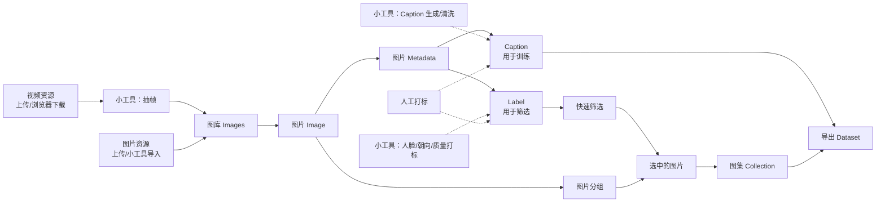

# UI 设计文档：图片元数据驱动的人物数据集工作台

## 1. 设计定位

这个 App 的核心不是管理素材来源，而是整理一个最终可导出的、已标记好的图片 dataset。视频、网页、本地目录、URL 列表都只是导入通道；导入完成后，dataset 主要关心每张图片及其 metadata。

核心 metadata 包括：

- 图片质量：清晰度、曝光、色彩、信息量、分辨率、重复度。
- 主体是谁：当前版本是 Person ID、人物名称、是否已确认；未来可扩展为物品、动物、车辆等实体。
- 主体朝向：当前人物使用正面、侧面、背面、未知；未来物品可扩展为正视图、侧视图、背视图、细节图等视角。
- 脸部完整度：完整、部分、无脸、未知。
- 人脸与人物数量：face count、person count、主人物。
- 可用性：可训练、拒绝、需要复核。
- 标记状态：自动、人工确认、二次复核。

图片 metadata 分为两类：

- Label：结构化标签，用于筛选、统计、配额组包和导出范围控制，例如人物、朝向、质量、完整度、复核状态。
- Caption：训练文本，用于 image LoRA dataset，例如人物外观、动作、服装、场景、构图、需要保留或屏蔽的训练提示词。

这些 metadata 的主要用途是快速筛选、配额抽样和组包。例如：为某个人筛出 30 张正面、20 张侧面、10 张背面，且全部满足质量阈值和人工确认状态。当前版本先做人，设计上保留主体类型字段，后续可用同一套筛选/配额机制处理某个物品。

来源信息只作为可选的导入日志和调试信息，不作为 dataset 的主维度，也不默认导出。

## 2. 信息架构

主导航围绕图片元数据和复核流程设计。

```text
Dataset Workbench
├─ 0. 总览 Dashboard
├─ 1. 导入 Inbox
├─ 2. 内置浏览器 Browser
├─ 3. 下载队列 Downloads
├─ 4. 图片库 Images
├─ 5. 抽帧 Frames
├─ 6. 质量 Quality
├─ 7. 人物 People
├─ 8. 标记 Review
├─ 9. 组包 Selection
├─ 10. 导出 Export
└─ 11. 设置 Settings
```

顶部全局栏：

- 当前 dataset 名称。
- 图片数、已确认数、可导出数。
- 全局搜索：图片文件名、人物名、标签、质量 flag、组包名称。
- 后台任务状态。
- 导出按钮。

左侧导航始终可见。页面标题下方固定放置该页的主操作按钮。

## 3. 全局对象关系



Dataset 的核心对象是 Image，而不是导入来源。视频资源、图片导入、小工具、人工打标、图片分组和图集创建之间保持松耦合：它们都围绕图库里的 Image 和 Image metadata 工作，但不要求按固定流水线依次执行。

关键关系：

- 视频资源可以来自本地上传，也可以来自内置浏览器下载；视频本身不直接进入最终 dataset，通常先由抽帧小工具生成图片，再进入图库。
- 图片可以本地上传，也可以由小工具导入或生成；进入图库后统一成为 Image。
- 图片可以被分组，分组用于整理和批量操作，但不等同于最终导出的图集。
- 小工具可以给图片写入自动 Label，例如人脸、人物朝向、质量分、脸部完整度；人工打标可以修正或确认这些 Label。
- Caption 是面向 image LoRA 训练的文本，可以由小工具生成，也可以人工编辑；它不作为主要筛选条件。
- 图集可以单独创建，并从图库中导入选中的图片。
- 选图片时可以使用已有 Label 快速筛选，例如人物、朝向、质量、完整度、复核状态。

每张 Image 的核心信息：

- 文件路径、尺寸、hash。
- 如果来自视频帧，记录视频内时间戳，但这只是技术 metadata。
- 质量指标和质量结论。
- 检测到的人脸框、关键点和 embedding。
- 所属主体。当前为人物，未来可以是物品实体。
- 朝向/视角、脸部完整度或主体完整度、人数/主体数、可用性。
- 训练文本 Caption，例如 caption、提示词、负面提示词或模板展开结果。
- 人工确认状态。

## 4. 页面设计

### 4.1 总览 Dashboard

用途：快速了解当前 dataset 的图片、人物、质量和标记状态。

布局：

```text
┌──────────────────────────────────────────────────────────────┐
│ 顶部栏：Dataset 名称 | 搜索 | 任务状态 | 导出                │
├──────────────┬───────────────────────────────────────────────┤
│ 左侧导航     │ 统计卡片                                      │
│              │ Images | People | Reviewed | Exportable       │
│              │ Front | Side | Back | Rejected               │
│              ├───────────────────────────────────────────────┤
│              │ Metadata 分布                                 │
│              │ 朝向 / 脸部完整度 / 人数 / 质量问题           │
│              ├───────────────────────────────────────────────┤
│              │ 待处理队列                                    │
│              │ 待抽帧 / 待质量检测 / 待人脸识别 / 待复核     │
└──────────────┴───────────────────────────────────────────────┘
```

主要组件：

- 图片统计：全部图片、候选图片、已确认、可导出、已拒绝。
- 人物统计：人物数、已确认人物、Unknown 人脸、疑似重复人物。
- 标签分布：正面、侧面、背面、未知。
- 质量分布：模糊、过暗、过曝、低色彩、低信息量、重复。
- 组包摘要：已保存的配额方案、缺口数量、可直接导出的 selection。
- 快捷入口：导入图片/视频、打开浏览器、继续复核、创建组包、导出 dataset。

关键交互：

- 点击统计卡片进入对应过滤视图。
- 空状态显示：导入图片或视频、打开浏览器、导入 URL 列表。
- Dashboard 的核心指标只显示图片、人物、标签和质量状态。

### 4.2 导入 Inbox

用途：把外部资源转换成图片库里的 Image。导入通道完成后，用户主要处理图片 metadata。

布局：

```text
┌──────────────────────────────────────────────────────────────┐
│ 操作栏：导入图片 | 导入视频 | 导入目录 | 导入 URL 列表        │
├──────────────────────────────────────────────────────────────┤
│ 导入批次表                                                   │
│ 状态 | 类型 | 文件数 | 生成图片数 | 错误数 | 创建时间         │
├──────────────────────────────────────────────────────────────┤
│ 批次详情：文件清单 / 错误 / 后续动作                         │
└──────────────────────────────────────────────────────────────┘
```

导入批次字段：

- 批次名。
- 类型：本地图片、本地视频、本地目录、URL 列表、浏览器捕获。
- 状态：待处理、处理中、完成、失败、已归档。
- 输入文件数。
- 生成 Image 数。
- 生成视频抽帧任务数。
- 错误数。

关键交互：

- 导入批次可以归档；归档不影响已经进入图片库的 Image。
- 导入批次不作为 dataset 的默认过滤维度，只作为操作历史。
- 对本地图片，导入后直接进入 Images。
- 对视频，导入后进入 Frames 抽帧。
- 对 URL，导入后进入 Downloads 下载队列。

### 4.3 内置浏览器 Browser

用途：打开网页、登录、发现可下载视频或图片资源。下载能力参考 `weinotes/video-downloader`，底层优先调用 `yt-dlp` 和 `gallery-dl`。

布局：

```text
┌──────────────────────────────────────────────────────────────┐
│ 地址栏：← → 刷新 URL 输入框 打开 捕获                        │
├──────────────────────────────────────┬───────────────────────┤
│                                      │ 捕获面板              │
│ WebView                              │ - 当前页面 URL        │
│                                      │ - 视频候选            │
│                                      │ - 图片候选            │
│                                      │ - 下载选项            │
└──────────────────────────────────────┴───────────────────────┘
```

捕获面板：

- 使用 `yt-dlp` 探测当前 URL。
- 使用 `gallery-dl` 探测当前 URL。
- 扫描当前页面图片。
- 手动粘贴链接。
- 选择下载质量：最佳、1080p、720p、仅图片、仅字幕。
- 选择 cookies 来源：无、Chrome、Edge、Firefox。

关键交互：

- 探测结果不直接进入 dataset，用户确认后生成下载任务。
- 下载完成的视频进入抽帧流程，图片进入 Images。
- 浏览器 URL 不默认成为导出 metadata。
- 不显示 cookie 明文。

### 4.4 下载队列 Downloads

用途：集中管理 URL 下载任务，类似 `weinotes/video-downloader` 的任务化图形界面。

布局：

```text
┌──────────────────────────────────────────────────────────────┐
│ 操作栏：开始 | 暂停 | 重试失败 | 清理完成 | 打开下载目录      │
├──────────────────────────────────────────────────────────────┤
│ 任务表格                                                     │
│ 状态 | 标题 | 下载器 | 质量 | 进度 | 速度 | 输出路径         │
├──────────────────────────────────────────────────────────────┤
│ 下方面板：任务日志 / yt-dlp 信息 / 失败原因                  │
└──────────────────────────────────────────────────────────────┘
```

任务状态：

- queued。
- probing。
- downloading。
- postprocessing。
- completed。
- failed。
- skipped。

关键交互：

- 完成后按文件类型进入 Images 或 Frames。
- 失败任务只影响导入，不污染 dataset。
- 可以复制失败命令用于调试。
- 下载 URL 不默认出现在最终导出 metadata 中。

### 4.5 图片库 Images

用途：查看和筛选所有已经进入 dataset 工作区的图片。这里是核心页面之一。

布局：

```text
┌──────────────────────────────────────────────────────────────┐
│ 筛选栏：人物 朝向 完整度 人数 质量 状态 尺寸 重复             │
├─────────────────────┬────────────────────────────────────────┤
│ 图片网格             │ 图片详情                               │
│ 缩略图 + metadata    │ 预览 / 人脸 / 质量 / 标签 / 文件信息    │
└─────────────────────┴────────────────────────────────────────┘
```

网格卡片显示：

- 缩略图。
- 人物名或 Unknown。
- 朝向：Front / Side / Back / Unknown。
- 质量状态：Good / Blurry / Dark / Low color / Duplicate。
- 复核状态：Auto / Reviewed / Rejected。

详情面板：

- 图片基本信息：尺寸、格式、hash、文件路径。
- 质量指标：blur score、brightness、saturation、entropy、duplicate group。
- 人脸信息：face count、bbox、landmarks、face confidence。
- 人物标签：Person、orientation、face completeness、usability。
- 技术上下文：如果是视频帧，显示视频时间戳；如果是下载图片，显示导入批次编号。

关键交互：

- 图片库筛选全部围绕 metadata，不围绕来源。
- 支持批量改标签，例如将选中图片标记为侧面或拒绝。
- 支持把当前筛选结果加入 Selection，用于后续配额组包。
- 支持进入单张复核。
- 删除记录默认不删除原始文件，删除文件需要二次确认。

### 4.6 抽帧 Frames

用途：把视频素材转换成 Image。抽帧页面是导入加工工具，不是 dataset 主视图。

布局：

```text
┌──────────────────────────────────────────────────────────────┐
│ 配置栏：间隔 1s | 搜索步长 0.2s | 最小短边 | 开始抽帧        │
├─────────────────────┬────────────────────────────────────────┤
│ 视频批次/视频列表    │ 时间轴 + 帧网格                         │
│ 状态 / 时长 / 进度   │ 目标时间 | 实际时间 | 状态 | 缩略图     │
├─────────────────────┴────────────────────────────────────────┤
│ 下方面板：抽帧日志 / 跳过原因 / FFmpeg 输出摘要              │
└──────────────────────────────────────────────────────────────┘
```

帧状态：

- pending。
- extracted。
- replaced_by_neighbor。
- skipped_no_good_frame。
- failed。

关键交互：

- 抽出的帧进入 Images，并带有 frame metadata。
- 用户可以手动选择邻近帧替换自动选择结果。
- 对已抽帧视频可重新抽帧，重复图片通过 hash 或重复检测处理。

### 4.7 质量 Quality

用途：围绕图片质量 metadata 进行筛选、调阈值和批量处理。

布局：

```text
┌──────────────────────────────────────────────────────────────┐
│ 阈值栏：模糊 色彩 亮度 信息量 分辨率 重复度 应用/预览        │
├─────────────────────┬────────────────────────────────────────┤
│ 问题类型列表         │ 图片网格                                │
│ Blurry               │ 缩略图 + flags + quality_score          │
│ Dark                 │                                        │
│ Low color            │                                        │
│ Duplicate            │                                        │
├─────────────────────┴────────────────────────────────────────┤
│ 操作栏：接受 | 拒绝 | 需要复核 | 批量处理                    │
└──────────────────────────────────────────────────────────────┘
```

关键交互：

- 阈值调整先预览影响数量，再批量应用。
- 每张图片保留自动 flags 和人工质量决策。
- 支持按人物、朝向、完整度、复核状态过滤。
- 质量筛选只改变图片 metadata，不删除图片。

### 4.8 人物 People

用途：展示自动聚类的人物分组，支持人工修正。Person 是当前版本的核心主体标签；未来可扩展为 Entity 页面，用于物品等非人物主体。

布局：

```text
┌──────────────────────────────────────────────────────────────┐
│ 操作栏：运行聚类 | 查找疑似重复 | 合并 | 拆分 | 重命名        │
├─────────────────────┬───────────────────────┬────────────────┤
│ 人物列表             │ 当前人物 face crops    │ 详情/候选合并  │
│ Person 001           │ 网格：脸图、分数、状态 │ 代表脸         │
│ Person 002           │                       │ 相似人物       │
│ Unknown              │                       │ 聚类参数       │
└─────────────────────┴───────────────────────┴────────────────┘
```

人物字段：

- Person ID。
- 显示名。
- face 数量。
- image 数量。
- 正面/侧面/背面数量。
- 已确认状态。
- 疑似重复提示。
- 代表脸。

关键交互：

- 合并：把多个 Person 合成一个。
- 拆分：选中若干 face crop 新建 Person。
- 标记误检：把 face 从聚类中排除。
- 设置代表脸。
- 查看该人物全部图片，并进入 Review。
- 创建该人物的配额组包，例如 30 张正面、20 张侧面、10 张背面。

### 4.9 标记 Review

用途：高效率完成最终人工标签。这个页面决定哪些图片进入最终 dataset。

布局：

```text
┌──────────────────────────────────────────────────────────────┐
│ 筛选栏：人物 朝向 完整度 人数 质量 状态 只看未复核           │
├──────────────┬───────────────────────────────┬───────────────┤
│ 图片队列      │ 大图预览                       │ Metadata 面板  │
│ 缩略图        │ 人脸框 / 关键点 / 邻近帧        │ 人物           │
│              │                               │ 朝向           │
│              │                               │ 完整度         │
│              │                               │ 质量           │
│              │                               │ 可用性         │
└──────────────┴───────────────────────────────┴───────────────┘
```

Metadata 面板：

Label 区用于筛选和组包：

- 人物：自动分组结果，可改为其它 Person 或 Unknown。
- 朝向：正面、侧面、背面、未知。
- 脸部完整度：完整、部分、无脸、未知。
- 人物数量：自动值 + 人工修正。
- 质量结论：合格、模糊、低色彩、过暗、重复、人工接受。
- 可用性：可训练、拒绝、需要二次复核。

Caption 区用于训练输出：

- caption：image LoRA dataset 对应的训练文本。
- positive prompt：训练时希望保留的主体、动作、服装、场景、构图描述。
- negative prompt / exclude notes：训练时希望排除或降低权重的内容。
- 备注：只供人工协作或复核参考，不默认进入训练文本。

快捷键建议：

| 键 | 操作 |
|---|---|
| Space | 接受并下一张 |
| R | 拒绝 |
| F | 正面 |
| S | 侧面 |
| B | 背面 |
| C | 脸部完整 |
| P | 脸部不完整 |
| U | Unknown |
| Left/Right | 上一张/下一张 |

关键交互：

- 自动 metadata 以浅色显示，人工确认后变为高亮。
- Label 变化立即影响筛选、统计和组包；Caption 变化只影响训练文本导出。
- 对视频帧显示邻近帧时间轴，允许替换为更好帧。
- 一张图有多个人脸时，右侧按 face 列出多条人物标签。
- 最终 dataset 默认只导出 `reviewed + trainable`。

### 4.10 组包 Selection

用途：按 metadata 快速筛选并凑出满足数量要求的数据集子集。它面向“我需要某个人多少张正面、多少张侧面、多少张背面”这类任务。

布局：

```text
┌──────────────────────────────────────────────────────────────┐
│ 操作栏：新建组包 | 从当前筛选创建 | 自动补齐 | 锁定结果       │
├─────────────────────┬────────────────────────────────────────┤
│ 组包列表             │ 配额规则                                │
│ Person A portrait    │ 人物 | 朝向 | 数量 | 质量 | 复核状态    │
│ Object draft future  │ A    | 正面 | 30   | Good | Reviewed    │
│                      │ A    | 侧面 | 20   | Good | Reviewed    │
│                      │ A    | 背面 | 10   | Good | Reviewed    │
├─────────────────────┴────────────────────────────────────────┤
│ 候选结果：已选 / 缺口 / 冲突 / 可替换图片                    │
└──────────────────────────────────────────────────────────────┘
```

配额规则字段：

- 主体类型：当前固定为 person，未来可选 object。
- 主体：Person ID 或未来 Entity ID。
- 朝向/视角：front、side、back、unknown，未来可扩展。
- 数量：目标张数。
- 质量条件：最低 quality score、排除 flags。
- 标记条件：reviewed、trainable、非重复。
- 多样性条件：可选，避免连续帧或近重复图过多。

关键交互：

- 自动补齐：系统按规则挑选图片，优先质量高、已复核、重复度低的图片。
- 缺口提示：例如“Person A 背面还缺 4 张”。
- 可替换图片：用户可手动替换某张质量边缘或姿态不理想的图片。
- 锁定结果：锁定后导出使用固定图片集合，后续新增图片不会自动改变该组包。
- 复制规则：同一套 30/20/10 配额可快速套用到其它人物。

### 4.11 导出 Export

用途：把当前已标记图片 dataset 或某个 Selection 以明确格式导出。导出范围由图片 metadata 或已锁定组包决定。

布局：

```text
┌──────────────────────────────────────────────────────────────┐
│ 导出配置                                                     │
│ 格式：JSONL CSV COCO YOLO FiftyOne CVAT Label Studio         │
│ 范围：全部可训练 | 指定人物 | 指定朝向 | 指定质量 | 组包      │
│ 文件：复制图片 | 软链接 | 只导出索引                         │
├──────────────────────────────────────────────────────────────┤
│ 导出预览                                                     │
│ 图片数 | 人物数 | 朝向分布 | 质量分布 | 拒绝项排除数量       │
├──────────────────────────────────────────────────────────────┤
│ 导出历史                                                     │
└──────────────────────────────────────────────────────────────┘
```

导出选项：

- 是否包含未确认自动标签。
- 是否导出训练文本 Caption：caption、positive prompt、negative prompt、模板展开结果。
- 是否包含 rejected / needs_review。
- 是否重命名文件。
- 是否按人物分目录。
- 是否按朝向分目录。
- 是否裁剪人脸图。
- 是否导出整图 + bbox。
- 是否导出技术 metadata，例如 frame timestamp、质量分、人脸框。
- 是否从 Selection 导出，并保留 selection manifest。

导出时 Label 决定“哪些图片被选中”，Caption 决定“这些图片对应的训练文本是什么”。

关键交互：

- 导出前显示问题检查：未确认人物、缺失朝向、缺失完整度、低质量但可训练、Unknown 比例过高。
- 每次导出生成 manifest，记录导出时间、过滤条件、格式、文件数量。
- 默认导出不包含 URL 或外部来源字段。

### 4.12 设置 Settings

用途：全局配置和本地运行参数。

页面分组：

- 下载：yt-dlp 路径、gallery-dl 路径、FFmpeg 路径、默认质量、cookies 来源。
- 存储：图片目录、缓存目录、缩略图目录、导出目录。
- 抽帧：默认间隔、搜索步长、最大候选数。
- 质量：模糊、亮度、色彩、信息量、分辨率阈值。
- 人脸：InsightFace 模型、检测阈值、最小脸尺寸、CPU 线程数。
- Dataset metadata：主体类型、人物命名规则、朝向/视角枚举、完整度枚举、导出字段。
- 组包：默认质量阈值、是否排除近重复、自动补齐排序规则。
- 隐私：是否保留导入日志、是否在导出 manifest 中包含技术上下文。
- 快捷键：复核页面快捷键配置。

## 5. Metadata 模型

### 5.1 Image 状态

```text
new
quality_checked
face_processed
clustered
needs_review
reviewed_trainable
reviewed_rejected
exported
```

### 5.2 Person 状态

```text
auto
confirmed
needs_merge_review
ignored
```

### 5.3 Subject Type

```text
person
object   # 未来扩展
```

### 5.4 Label 状态

```text
auto
reviewed
needs_second_review
rejected
```

### 5.5 Label / Caption 分层

```text
Label       # 结构化标签，用于筛选、统计、配额组包和导出范围控制
Caption     # 训练文本，用于 image LoRA dataset 的 caption、prompt、负面提示和模板展开结果
```

Label 应尽量结构化，例如人物、朝向、质量、完整度、可用性、复核状态。Caption 可以是更自由的训练文本，但需要记录来源：自动生成、人工编辑或模板生成。

### 5.6 Orientation / Viewpoint

```text
front
side
back
unknown
```

### 5.6 Face / Subject Completeness

```text
full
partial
none
unknown
```

### 5.7 Selection Rule

```text
subject_type: person | object
subject_id
orientation_or_viewpoint: front | side | back | unknown
target_count
quality_filter
review_filter
dedupe_filter
```

## 6. 视觉与交互原则

- 工具感优先：界面应像数据工作台，不像素材管理器。
- 图片 metadata 是第一层信息，导入记录是第二层调试信息。
- 列表、网格、详情三栏是主模式。
- 每个自动结论都要显示指标，例如质量分、人脸置信度、聚类距离。
- 任何最终标签都应能区分 `auto` 和 `reviewed`。
- 删除动作默认只删除记录，不删除磁盘原文件，除非二次确认。
- 批量操作必须先预览影响数量。 
- 导出默认围绕人物、朝向、完整度、质量和复核状态过滤。
- 支持把过滤条件保存成 Selection，并按目标数量自动组包。
- 当前 UI 文案以人物为主，但底层字段尽量使用主体/视角等可扩展概念。

## 7. 空状态设计

首次打开不显示“创建项目”，而显示三个入口：

```text
开始构建 dataset

[导入本地图片]  [导入本地视频]  [打开内置浏览器]

导入完成后，所有内容都会转换为图片和图片 metadata。最终导出时只按人物、朝向、完整度、质量和复核状态选择数据。
```

## 8. MVP 页面优先级

第一版必须实现：

1. 总览 Dashboard。
2. 导入 Inbox。
3. 下载队列 Downloads。
4. 图片库 Images。
5. 抽帧 Frames。
6. 质量 Quality。
7. 人物 People。
8. 标记 Review。
9. 组包 Selection。
10. 导出 Export。
11. 设置 Settings。

内置浏览器可以在 MVP 后半段实现。如果时间紧，第一版可先提供 URL 输入和 URL 列表导入，但数据模型必须以 Image metadata 为核心。

## 9. 与系统设计文档的关系

[DESIGN.md](DESIGN.md) 负责系统架构、模块和算法设计。本文件负责 UI、页面、状态和交互设计。

后续实现时，dataset 不应围绕来源建模。导入和下载只是把外部资源转换成 Image 的手段；导出、复核和组包只关心图片 metadata，例如人物、朝向、背面/侧面/正面、脸部完整度、质量和可用性。当前先做人，未来扩展物品时复用主体、视角、完整度、质量和配额筛选机制。
